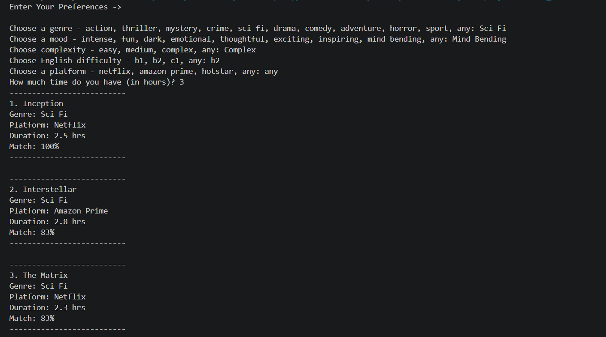

# 🎬 Python Movie Recommendation System

A command-line Python application that recommends movies based on user preferences using a custom scoring algorithm. The application analyzes multiple user preferences, calculates a match score for each movie, and recommends the top three matches.

---

## 📖 About

This project demonstrates the implementation of a simple movie recommendation engine using core Python concepts. Users provide their preferences, and the application scores every movie based on matching criteria before displaying the best recommendations along with their match percentage.

The primary goal of this project is to practice clean code, modular programming, input validation, and algorithmic thinking using Python.

---

## ✨ Features

- 🎯 Recommends the **Top 3** matching movies
- 📊 Displays the match percentage for each recommendation
- 🎭 Filter movies by:
  - Genre
  - Mood
  - Complexity
  - English Difficulty (B1 / B2 / C1)
  - Streaming Platform
  - Available Watch Time
- ✅ Validates all user inputs
- 🔀 Randomizes movie order before scoring to avoid repetitive recommendations when multiple movies have the same score
- 🧩 Clean, modular function-based architecture

---

## 📸 Example Output



---

## 🧠 Recommendation Algorithm

Each movie earns **1 point** for every matching preference.

| Preference | Score |
|------------|:-----:|
| Genre | +1 |
| Mood | +1 |
| Complexity | +1 |
| English Difficulty | +1 |
| Platform | +1 |
| Duration | +1 |

**Maximum Score:** **6**

Movies are then sorted in descending order based on their score, and the top three recommendations are displayed.

---

## 🛠️ Technologies Used

- Python 3
- Python Standard Library (`random`)

---

## 📚 Key Python Concepts

- Functions
- Modular Programming
- Lists
- Tuples
- Dictionaries
- List of Dictionaries
- Loops
- Conditional Statements
- Input Validation
- Error Handling (`try` / `except`)
- Sorting with `sorted()`
- Lambda Functions
- Dictionary Copying (`copy()`)
- String Manipulation
- `if __name__ == "__main__"`

---

## 📂 Project Structure

```text
python-movie-recommendation-system/
│
├── movie_recommendation_system.py
├── README.md
├── .gitignore
└── screenshot.png
```

---

## 🚀 How to Run

### 1. Clone the repository

```bash
git clone https://github.com/dewansh-codes/python-movie-recommendation-system.git
```

### 2. Navigate to the project folder

```bash
cd python-movie-recommendation-system
```

### 3. Run the program

```bash
python movie_recommendation_system.py
```

---

## 💡 Future Improvements

- Refactor the project using Object-Oriented Programming (OOP)
- Store the movie dataset in a JSON file
- Integrate a MySQL database
- Build a REST API using FastAPI
- Support multiple genre selection
- Expand the movie dataset
- Improve the recommendation algorithm

---

## 👨‍💻 Author

**Dewansh Gupta**

GitHub: https://github.com/dewansh-codes

---

## ⭐ Support

If you found this project helpful or interesting, consider giving it a ⭐ on GitHub.
